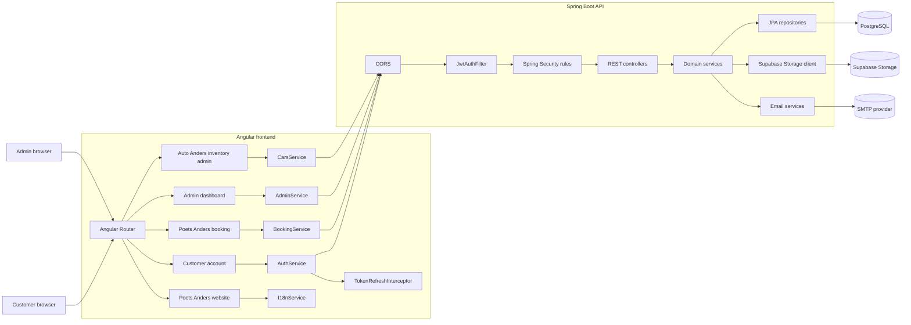
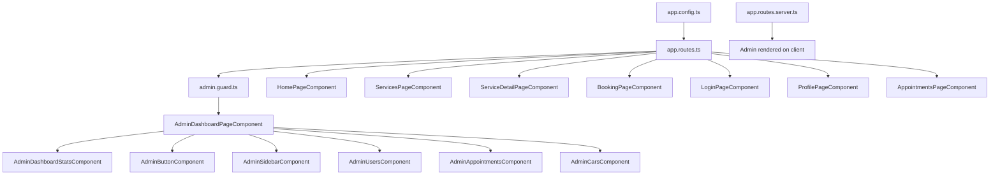
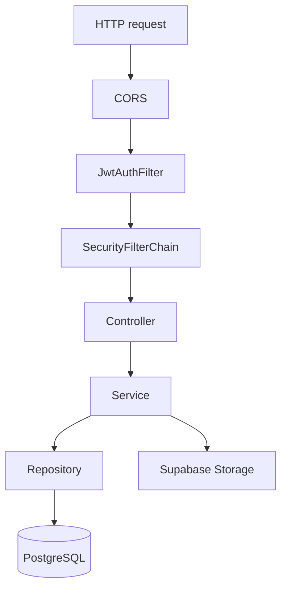
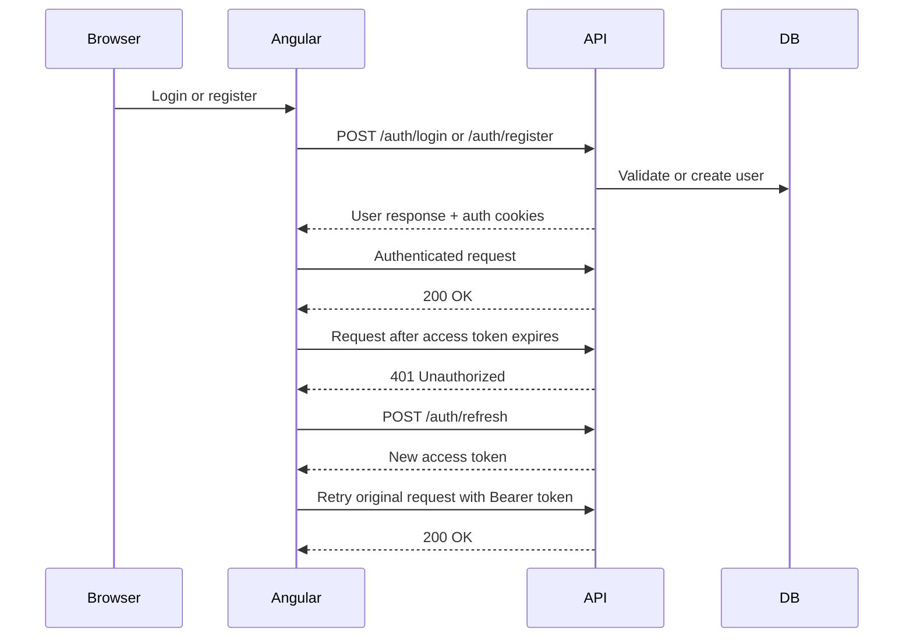
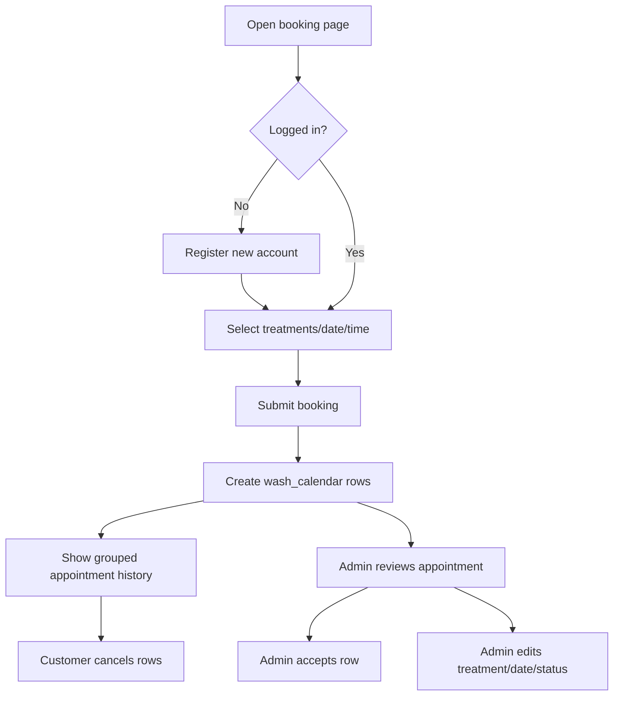
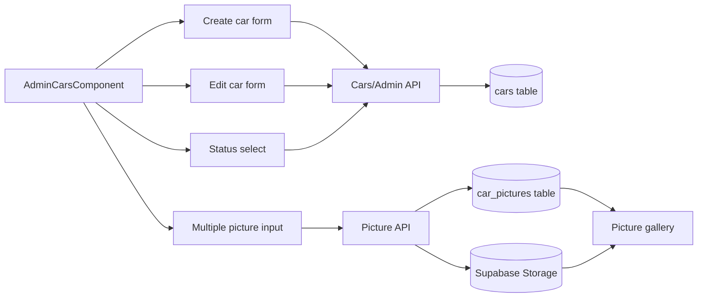
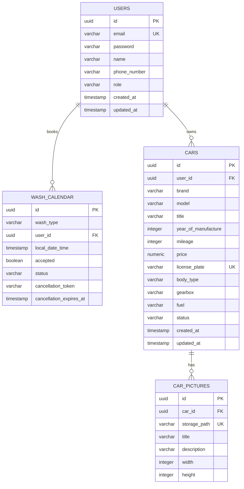
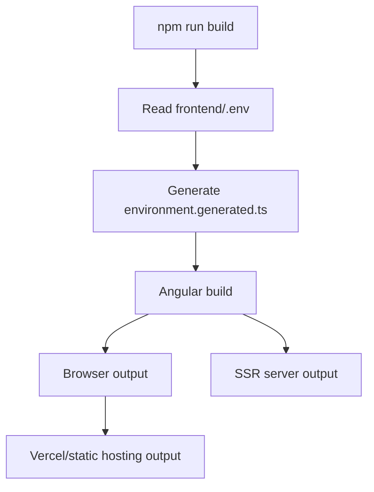
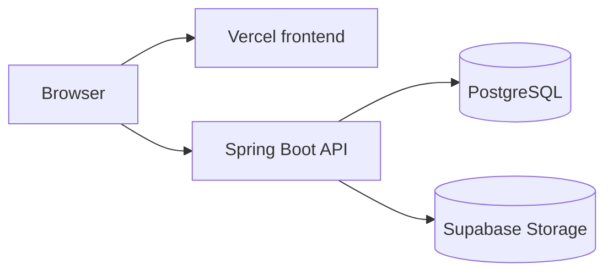

# Poets Anders / Auto Anders

Full-stack business platform for two connected business areas:

- **Poets Anders**: vehicle cleaning/detailing website, booking system, customer accounts, and appointment administration.
- **Auto Anders**: car-selling inventory management with detailed vehicle data and multi-picture uploads.

The project is built as a practical full-stack portfolio application: Angular on the frontend, Spring Boot on the backend, PostgreSQL for relational data, and Supabase Storage for vehicle pictures.

## Table of Contents

- [Product Areas](#product-areas)
- [Feature Overview](#feature-overview)
- [Technology Stack](#technology-stack)
- [System Architecture](#system-architecture)
- [Repository Structure](#repository-structure)
- [Frontend Architecture](#frontend-architecture)
- [Backend Architecture](#backend-architecture)
- [Authentication and Authorization](#authentication-and-authorization)
- [Booking and Appointment Logic](#booking-and-appointment-logic)
- [Car and Picture Logic](#car-and-picture-logic)
- [Database Model](#database-model)
- [API Reference](#api-reference)
- [Environment Variables](#environment-variables)
- [Local Development](#local-development)
- [Testing and Verification](#testing-and-verification)
- [Build and Rendering](#build-and-rendering)
- [Deployment](#deployment)
- [Known Issues and Security Gaps](#known-issues-and-security-gaps)
- [Development Guidelines](#development-guidelines)

## Product Areas

| Product area | Purpose | Main users | Main features |
| --- | --- | --- | --- |
| **Poets Anders** | Vehicle cleaning and detailing business | Customers and admins | Public website, treatment pages, booking flow, customer accounts, appointment management |
| **Auto Anders** | Car selling and inventory management | Admins and potential car buyers | Car inventory, full vehicle details, availability status, multiple pictures, Supabase-hosted images |

Both parts share the same Angular frontend, Spring Boot backend, authentication system, PostgreSQL database, and admin dashboard. The split is functional: Poets Anders handles services and appointments, while Auto Anders handles cars and pictures.

## Feature Overview

### Poets Anders

Poets Anders is the customer-facing detailing and booking side of the project.

#### Public Website

- Responsive business website for the detailing company.
- Service/treatment overview and individual treatment detail pages.
- FAQ, testimonials, location, contact, and business information.
- Runtime language switching for English, Dutch, and German.
- Shared navbar and footer.
- Configurable link to the Auto Anders/dealership side through `DEALERSHIP_URL`.

#### Booking System

- Customers can book one or more detailing treatments.
- Booking supports date, time, treatment selection, and customer details.
- New customers can register during booking.
- Existing customers can log in and book with their account.
- Customers can view appointment history and upcoming appointments.
- Customers can cancel appointment rows.
- Admins can accept and edit appointments.

#### Customer Account

- Cookie-based login.
- Session restore through `/auth/me`.
- Profile editing for name, phone number, and password.
- Appointment history with localized date formatting.

#### Appointment Administration

- `/admin` is protected with Angular `canMatch` and backend role checks.
- Dashboard loads users, appointments, summary statistics, and cars.
- Poets Anders admin work focuses on users and appointments.
- Admin sections are controlled by query params:

```text
/admin?section=users
/admin?section=appointments
/admin?section=cars
```

Admins can:

- View dashboard statistics.
- Search and paginate users.
- Create new users.
- Edit user name, email, phone number, and role.
- Search, filter, paginate, accept, and edit appointments.

### Auto Anders

Auto Anders is the car-selling and vehicle inventory side of the project. It shares the same backend, authentication, admin area, and database, but focuses on vehicle data instead of detailing appointments.

#### Car Selling / Inventory Module

Admins can:

- Search, filter, paginate, create, edit, and update cars.
- Change car availability status.
- Add cars as the logged-in admin.
- Upload multiple pictures for a car.
- Preview selected pictures before upload.
- Open a per-car picture gallery.
- See backend creation errors in a popup.

Cars support detailed commercial and technical data:

- Brand, model, title, subtitle, year, mileage, power, reference number, and price.
- First registration date, license plate, chassis number, APK/MOT date, location, and service documentation.
- Body type, gearbox, fuel, emission class, energy label, paint type, and upholstery.
- Doors, wheelbase, cylinders, engine displacement, empty weight, towing weights, tax details, and CO2 emissions.
- Urban, motorway, and combined fuel consumption.
- Financial lease prices for multiple terms.
- Status values: `Available`, `Pending_Confirmation`, `Booked`, and `Cancelled`.
- Multiple pictures stored in Supabase Storage and linked through PostgreSQL metadata.

## Technology Stack

| Layer | Technology |
| --- | --- |
| Frontend framework | Angular 21 standalone components |
| Frontend language | TypeScript 5.9 |
| State management | Angular signals, computed signals, RxJS |
| Forms | Angular Forms and Reactive Forms |
| Routing | Angular Router |
| Styling | Tailwind CSS 4 |
| Rendering | Angular SSR, hydration, prerender configuration |
| Backend framework | Spring Boot 3.5 |
| Backend language | Java 21 |
| Security | Spring Security, BCrypt, JJWT |
| Persistence | PostgreSQL, Spring Data JPA, Hibernate |
| Migrations | Flyway |
| File storage | Supabase Storage |
| Email | Spring Mail |
| Tooling | npm, Maven Wrapper, Docker |

## System Architecture



### Request Boundaries

1. Angular components call frontend services.
2. Frontend services call the Spring API with credentials.
3. Spring Security validates access tokens from cookies or Bearer headers.
4. Controllers convert HTTP input into service calls.
5. Services enforce business logic.
6. Repositories persist relational data in PostgreSQL.
7. Picture bytes are stored in Supabase Storage.
8. Picture metadata and public URLs are returned to the Angular UI.

## Repository Structure

```text
poetsanders/
|-- frontend/
|   |-- public/                    Static frontend assets
|   |-- scripts/                   Environment generation scripts
|   |-- src/app/
|   |   |-- core/
|   |   |   |-- admin/              Admin HTTP client
|   |   |   |-- auth/               Auth service and refresh interceptor
|   |   |   |-- booking/            Appointment HTTP client
|   |   |   |-- cars/               Cars and picture HTTP client
|   |   |   |-- i18/                Locale state and translations
|   |   |   `-- interfaces/         Shared TypeScript contracts
|   |   |-- features/
|   |   |   |-- admin/              Admin dashboard and management tables
|   |   |   |-- appointments/       Appointment history
|   |   |   |-- faq/                FAQ page
|   |   |   |-- form/               Booking flow
|   |   |   |-- home/               Public landing page
|   |   |   |-- login/              Login page
|   |   |   |-- profile/            Profile editor
|   |   |   `-- services/           Treatment pages
|   |   `-- shared/                Navbar and footer
|   |-- angular.json
|   |-- package.json
|   `-- proxy.conf.cjs
|
|-- backend/
|   `-- AutoAnders/
|       |-- src/main/java/Gloyoo/AutoAnders/
|       |   |-- config/             Security, JWT, CORS, datasource
|       |   |-- user/               Auth, users, admin dashboard
|       |   |-- washCalendar/       Booking and appointments
|       |   |-- Cars/               Vehicle inventory
|       |   |-- CarPictures/        Picture metadata
|       |   |-- notification/       Email services
|       |   `-- storage/            Supabase picture upload
|       |-- src/main/resources/
|       |   |-- db/migration/       Flyway migrations
|       |   `-- application.yaml
|       |-- compose.yaml
|       |-- Dockerfile
|       |-- mvnw / mvnw.cmd
|       `-- pom.xml
|
|-- vercel.json
`-- README.md
```

## Frontend Architecture

The frontend uses standalone Angular components. There is no root NgModule. Global providers are configured in `app.config.ts`, route rendering modes are configured in `app.routes.server.ts`, and the admin page is lazy loaded behind a `canMatch` guard.



### Frontend Routes

| Route | Component | Purpose |
| --- | --- | --- |
| `/` | `HomePageComponent` | Public home page |
| `/book` | `BookingPageComponent` | Booking flow |
| `/services` | `ServicesPageComponent` | Treatment overview |
| `/services/:slug` | `ServiceDetailPageComponent` | Treatment detail page |
| `/faq` | `FaqPageComponent` | Frequently asked questions |
| `/login` | `LoginPageComponent` | Login |
| `/profile` | `ProfilePageComponent` | Profile editor |
| `/appointments` | `AppointmentsPageComponent` | Appointment history |
| `/admin` | Lazy-loaded `AdminDashboardPageComponent` | Admin dashboard |

### Core Frontend Services

| Service | Responsibility |
| --- | --- |
| `AuthService` | Register, login, logout, session restore, profile updates |
| `TokenRefreshInterceptor` | Refresh expired access tokens and retry failed requests |
| `BookingService` | Create, list, group, and cancel appointments |
| `AdminService` | Dashboard data, user creation/editing, appointment editing, car editing |
| `CarsService` | Public car reads, car creation/status updates, picture uploads |
| `I18nService` | Runtime language state and typed translations |

### Admin Components

| Component | Responsibility |
| --- | --- |
| `AdminDashboardPageComponent` | Loads dashboard/cars, reads section query params, updates parent state |
| `AdminDashboardStatsComponent` | Summary cards |
| `AdminButtonComponent` | Localized shortcut links to admin sections |
| `AdminSidebarComponent` | Section navigation |
| `AdminUsersComponent` | Search, pagination, user create/edit |
| `AdminAppointmentsComponent` | Search, status filter, pagination, accept/edit appointments |
| `AdminCarsComponent` | Search, status filter, details modal, picture gallery, create/edit forms, multi-picture upload |

## Backend Architecture

The backend follows controller, service, repository, DTO, and entity boundaries.



### Backend Domains

| Package | Responsibility |
| --- | --- |
| `config` | Security, JWT, CORS, datasource |
| `user` | Auth, profile, admin users, dashboard responses |
| `washCalendar` | Appointment creation, acceptance, cancellation, cleanup |
| `Cars` | Vehicle inventory and status management |
| `CarPictures` | Picture metadata and picture upload endpoints |
| `notification` | Registration, booking, cancellation, and car-management emails |
| `storage` | Supabase Storage upload and public URL resolution |

## Authentication and Authorization

The backend issues access and refresh JWTs. Passwords are hashed with BCrypt. Access tokens authenticate API requests; refresh tokens are used by `/auth/refresh`.



### Current Authorization Behavior

- `OPTIONS /**` is public for CORS preflight.
- `/auth/**`, `/`, and `/health` are public.
- Admin endpoints under `/admin/**` require `ADMIN`.
- Admin appointment acceptance routes require `ADMIN`.
- Car status updates require `ADMIN`.
- `GET /cars/**` is public.
- `POST /cars` requires an authenticated user.
- The Angular `/admin` route uses `canMatch` and calls `/auth/me` so non-admin users do not load the admin dashboard.
- Backend Spring Security remains the real security boundary.

## Booking and Appointment Logic

One appointment card can represent multiple backend rows when the customer selects multiple treatments for the same date/time.



### Appointment Features

| Capability | User |
| --- | --- |
| Create appointment request | Customer |
| Book multiple treatments at once | Customer |
| View own appointments | Customer |
| Cancel own appointment rows | Customer |
| View all appointments | Admin |
| Accept appointment row | Admin |
| Edit treatment, date/time, and accepted status | Admin |

## Car and Picture Logic

Cars are stored relationally, while image files are stored in Supabase Storage.



### Current Car Features

- Add a new car from the admin dashboard.
- Newly added cars are owned by the logged-in admin.
- Edit all scalar and enum car details.
- Change car status.
- Search by brand, model, title, license plate, reference number, or year.
- Filter by car status.
- Upload multiple pictures.
- Show local previews before upload.
- Display backend errors in a popup when car creation fails.
- Resolve Supabase storage paths into public image URLs before display.

## Database Model

Flyway migrations define the schema, and Hibernate validates it at startup.



### Core Tables

| Table | Purpose |
| --- | --- |
| `users` | Customer and admin accounts |
| `wash_calendar` | Appointment/treatment booking rows |
| `cars` | Car-selling inventory |
| `car_pictures` | Metadata for Supabase-hosted car pictures |

## API Reference

### Auth API

| Method | Endpoint | Purpose |
| --- | --- | --- |
| `POST` | `/auth/register` | Create user account |
| `POST` | `/auth/login` | Log in |
| `POST` | `/auth/refresh` | Refresh access token |
| `POST` | `/auth/logout` | Clear auth cookies |
| `GET` | `/auth/me` | Restore current session |
| `PATCH` | `/auth/update` | Update profile |
| `GET` | `/auth/getUserCars` | List current user's cars |

### Booking API

| Method | Endpoint | Purpose |
| --- | --- | --- |
| `POST` | `/wash_calendar/guest` | Public guest appointment |
| `POST` | `/wash_calendar/batch` | Create multiple appointment rows |
| `GET` | `/wash_calendar` | Admin list all appointments |
| `GET` | `/wash_calendar/date/**` | Admin list appointments by date |
| `POST` | `/wash_calendar/accept/{id}` | Admin accept appointment |
| `DELETE` | `/wash_calendar/cancel/**` | Public cancellation token route |
| `DELETE` | `/wash_calendar/batch` | Cancel multiple owned rows |

### Admin API

| Method | Endpoint | Purpose |
| --- | --- | --- |
| `GET` | `/admin/dashboard` | Load totals, users, and appointments |
| `POST` | `/admin/users` | Create user |
| `PATCH` | `/admin/users/{id}` | Edit user |
| `PATCH` | `/admin/appointments/{id}` | Edit appointment |
| `POST` | `/admin/cars` | Create admin-owned car |
| `PATCH` | `/admin/cars/{id}` | Edit car |

### Cars and Pictures API

| Method | Endpoint | Purpose |
| --- | --- | --- |
| `GET` | `/cars` | Public car list |
| `GET` | `/cars/{id}` | Public car detail |
| `POST` | `/cars` | Create car for authenticated user |
| `PUT` | `/cars/{id}` | Update car |
| `PATCH` | `/cars/statusUpdate/{id}` | Admin update status |
| `DELETE` | `/cars/{id}` | Delete car |
| `GET` | `/cars/by_user` | Current user's cars |
| `GET` | `/cars/{carId}/pictures` | List car pictures |
| `POST` | `/cars/{carId}/pictures` | Upload one picture |
| `POST` | `/cars/{carId}/pictures/batch` | Upload multiple pictures |

## Environment Variables

### Frontend `.env`

```dotenv
API_BASE_URL=https://autoanders-api.onrender.com
API_PROXY_TARGET=http://localhost:8080
DEALERSHIP_URL=
```

| Variable | Purpose |
| --- | --- |
| `API_BASE_URL` | Backend origin compiled into Angular |
| `API_PROXY_TARGET` | Local backend target for the dev proxy |
| `DEALERSHIP_URL` | Optional external dealership URL |

The frontend pre-scripts generate:

```text
frontend/src/environments/environment.generated.ts
```

### Backend `.env`

```dotenv
SUPABASE_DB_URL=
SUPABASE_DB_USERNAME=
SUPABASE_DB_PASSWORD=
SUPABASE_JWT_SECRET=
BASE_URL=http://localhost:8080
MAIL_ENABLED=false
MAIL_HOST=smtp.gmail.com
MAIL_PORT=587
MAIL_USERNAME=
MAIL_PASSWORD=
MAIL_FROM=
```

Supabase picture uploads also require the storage URL, bucket, and service key used by `SupaBasePictureStorage`.

## Local Development

### Frontend

```bash
cd frontend
npm ci
npm start
```

Open:

```text
http://localhost:4200
```

### Backend

```powershell
cd backend/AutoAnders
.\mvnw.cmd spring-boot:run
```

Or with Docker Compose:

```bash
cd backend/AutoAnders
docker compose up --build
```

## Testing and Verification

Frontend:

```powershell
cd frontend
.\node_modules\.bin\ngc.cmd -p tsconfig.app.json
npm run build
```

Backend:

```powershell
cd backend/AutoAnders
.\mvnw.cmd compile
```

Full backend tests may require Docker because Testcontainers is included.

## Build and Rendering



| Command | Purpose |
| --- | --- |
| `npm start` | Generate environment and run Angular dev server |
| `npm run build` | Generate environment and build the app |
| `npm run watch` | Development build in watch mode |
| `npm test` | Run tests |
| `npm run serve:ssr:frontend` | Serve an existing SSR build |

## Deployment



- Frontend deployment is configured with `vercel.json`.
- The frontend can target the deployed API through `API_BASE_URL`.
- Backend can run as a Java service or Docker container.
- PostgreSQL stores users, appointments, cars, and picture metadata.
- Supabase Storage hosts uploaded car image files.
- CORS must allow the frontend origin and credentials.

## Known Issues and Security Gaps

- Backend authorization is the source of truth; frontend guards only improve user experience.
- Production cookies require correct HTTPS, CORS, and same-site configuration for the deployed domains.
- Full backend tests may require Docker because Testcontainers is included.
- Some car responses still expose domain entities; dedicated DTOs would be better for long-term API stability.
- Booking conflict rules should be reviewed if strict slot exclusivity is required.
- The active frontend is `frontend/`; `autoAnders/frontend/` is not the active app documented here.

## Development Guidelines

### Adding a Treatment

1. Add translations in English, Dutch, and German.
2. Add/update treatment content.
3. Add the backend `WashType` if needed.
4. Update frontend booking mappings.
5. Verify booking, appointment display, and service detail routing.

### Adding a Car Field

1. Add the backend entity/request field.
2. Add a Flyway migration.
3. Add the TypeScript field in `Car` and `CarRequest`.
4. Add it to the admin create/edit form.
5. Verify persistence, display, and edit behavior.

### Adding an Admin Section

1. Add the section to `AdminSection`.
2. Add sidebar and shortcut button labels in all languages.
3. Add the section component.
4. Add `AdminService` methods for backend calls.
5. Protect backend endpoints with admin authorization.

### Recommended Hardening

1. Add end-to-end tests for booking and admin car creation.
2. Expand unit coverage for token refresh and guards.
3. Replace remaining car entity responses with DTOs.
4. Add stricter booking conflict validation if the business requires exclusive time slots.
5. Review all production CORS and cookie settings before launch.

## Repository

[github.com/yassineao/poetsanders](https://github.com/yassineao/poetsanders)
